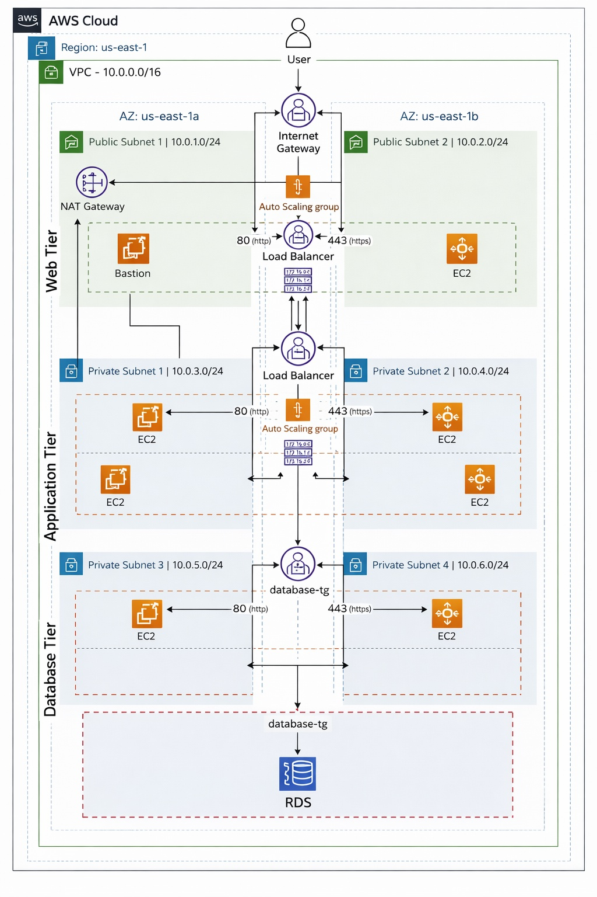

## Architecture Diagram

## Project Overview
This project demonstrates a highly available and scalable AWS 3-Tier architecture
designed using AWS best practices for security, availability, and performance.

## Architecture Description
The architecture is divided into three layers:

### 1. Web Tier
- Deployed in public subnets across multiple Availability Zones
- Internet-facing Application Load Balancer
- Auto Scaling Group of EC2 instances
- NAT Gateway for outbound internet access

### 2. Application Tier
- Hosted in private subnets
- Internal Load Balancer
- Auto Scaling Group for application servers
- Secure communication with the Web Tier

### 3. Database Tier
- Hosted in private subnets
- Amazon RDS (Multi-AZ)
- No direct internet access
- Accessible only from the Application Tier

## AWS Services Used
- Amazon VPC
- EC2
- Application Load Balancer
- Auto Scaling
- NAT Gateway
- Amazon RDS
- IAM
- Security Groups
  
## Deployment Steps

1. *Create VPC and Subnets*
   - Public subnets for Web Tier
   - Private subnets for App and DB Tier

2. *Configure Routing*
   - Attach Internet Gateway for public subnets
   - Add NAT Gateway for private subnets

3. *Launch Web Tier EC2*
   - Use user-data script for setup
   - Place in Auto Scaling Group behind ALB

4. *Launch Application Tier EC2*
   - Private subnets only
   - Internal ALB for traffic routing

5. *Deploy Database Tier*
   - Multi-AZ RDS instance
   - Private subnets only
   - Security Group restricted to App Tier

6. *Verify Deployment*
   - Test Web access via ALB
   - Test App connectivity to DB
   - Check security group rules

## Security Best Practices

- Web Tier only accessible via Internet-facing ALB
- Application and Database tiers in private subnets
- Security Groups with least privilege rules
- NAT Gateway for secure outbound access from private instances
- RDS Multi-AZ for high availability and disaster recovery

## Project Highlights

- Highly Available and Scalable AWS 3-Tier Architecture
- Proper folder structure for scripts, documentation, diagrams
- Real-world AWS services: VPC, EC2, ALB, Auto Scaling, RDS
- Professional GitHub repo layout
- Easy to explain in interviews
